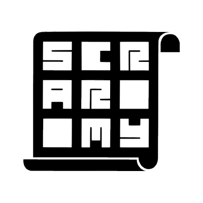

# Blog de la comunidad ScrollArmy



Compartimos articulos de interes o escritos por miembros del chapter de Pergamino, siempre podes sumarte a escribir y mandar un PR o darte una vuelta por nuestros grupos de Whatsapp o Telegram para consultar algo.

---

# Como realizar un post

1. Haces un fork del repo


2. Lo clonas a tu compu local (`git clone <url del fork tuyo>`)
3. Te moves a una branch de nuevo post (`git checkout new-post`)
4. Te copias el contenido de `/_post/example.md` (*También contiene ayudas para la hora de escribir* ) y lo guardas con el siguiente formato `YYYY-MM-DD-TITULO.md`

5. Limpiar los placeholders y ejemplos, dejar solo lo que vayas a utilizar
6. Te pones a escribir trancu y cuando lo tenes listo subis todo con un commit (`git commit -m "sarasa de detalle" #Esto a tu fork local`)
7. Haces un pull request al repo original 
8. El post se revisa y se mergea
9. `Gloria y descanso`
---
## Formatos y herramientas para crear el post

En la carpeta de /_post se encuentra el archivo example.md para ayudarse con el formato y entender como funciona la herramienta, a continuación revisamos algunos casos que no estan en el común de markdown

### Cabecera

~~~
---
layout: post
title: Sample blog post
subtitle: Each post also has a subtitle
comments: false
readtime: true
---
~~~

se pueden agregar mas campos opciones que rechazarse por no aplicar en el post, por ejemplo highlights/badges de un repo de github, también se pueden colocar miniaturas o imagenes de portada para la entrada de blog

~~~
gh-repo: user/repo
gh-badge: [star, fork, follow]
tags: [test]
thumbnail-img:  /path/to/image #Se muestra solo en el feed del sitio
cover-img: ["/path/img1", "/path/img2"] #Puede contener mas de una img
~~~

---

## Cuerpo del post

### Elementos basicos

Utilizando # se generan los titulares, desde 1 hasta 3 veces podemos juntarlos para generar 3 niveles distintos (# TEXTO)

~~~
# Titulo 1
## Titulo 2
### Titulo 3
~~~
**Texto en negritas**
~~~
**Texto en negritas**
~~~

*Texto en italica*
~~~
*Texto en italica*
~~~

> Quote text
~~~
> Quote text
~~~

Elementos para listar y enumerar 
1. Primer elemento
2. Seg elemento
3. Tercer elemento

- Primer elemento
- Seg elemento
- Tercer elemento
~~~
1. Primer elemento
2. Seg elemento
3. Tercer elemento

- Primer elemento
- Seg elemento
- Tercer elemento
~~~

Si queremos generar una linea horizontal divisoria utilizamos 
~~~
---
~~~

Para publicar [Links](#) se utiliza el formato
~~~
[Texto a mostrar](URL)
~~~

Uso de **Imagenes**

Esta es una imagen colocada en linea con el texto 


~~~

~~~

y para centrarla se agrega el siguiente codigo al final {: .mx-auto.d-block :}

~~~
{: .mx-auto.d-block :}
~~~

**TIP:** si queremos hacer una imagen que al hacerle click nos lleve a una url vamos a hacer un link que en lugar de un texto a mostrar tenga una imagen

~~~
[](URL)
~~~
[](https://www.scrollarmy.com.ar)

---

Para generar una **tabla** se utiliza el siguiente formato

~~~

| Number | Next number | Previous number |
| :------ |:--- | :--- |
| Five | Six | Four |
| Ten | Eleven | Nine |
| Seven | Eight | Six |
| Two | Three | One |
~~~

y este es el resultado 


| Number | Next number | Previous number |
| :------ |:--- | :--- |
| Five | Six | Four |
| Ten | Eleven | Nine |
| Seven | Eight | Six |
| Two | Three | One |

Como mostrar **bloques de codigo**

si queremos poner codigo sin formato usaremos el siguiente formato 

\~~~

codigo

\~~~

~~~
var foo = function(x) {
  return(x + 5);
}
foo(3)
~~~

Aca va igual pero formateado con colores

~~~
```<lenguaje>
codigo
```
~~~

```javascript
var foo = function(x) {
  return(x + 5);
}
foo(3)
```

y si queremos mostrar los numeros de lineas usamos lo siguiente. Notese que también se aclaró el lenguage utilizado
~~~

var foo = function(x) {
  return(x + 5);
}
foo(3)

~~~

También se puede generar cajas de notificación, alerta o peligro.


~~~
{: .box-note}
**Blue note:** This is a notification box.
~~~

~~~
{: .box-warning}
**Warning:** This is a warning box.
~~~

~~~
{: .box-error}
**Error:** This is an error box.
~~~
